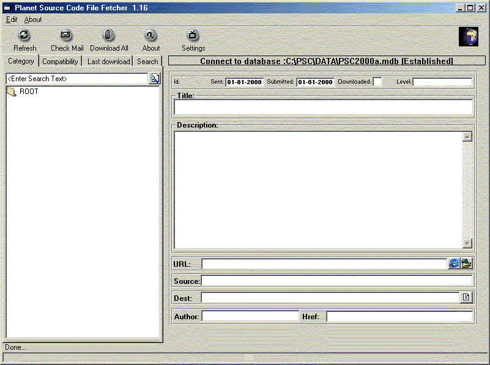



## Planet Source Code File Fetcher 1\.16

### Description

Convert your daily planet source code mail to a database

V1.16 :Add: Select your own Logfile (Settings)

V1.16 :Fix: Search and enter

V1.16 :Fix: Listview one title

V1.16 :Fix: ModStart

V1.16 :Fix: DBGrid32.ocx removed reference (Thanx Wendell Jackson)

V1.16 :Add: Hyperlink to Author homepage (if any)

New Download the 'Copy and past friendly page' if there is no zip file

NEW in this version , Tree view object for easy browsing

NEW author will be get from page (if any) and store in the tblAU_author table

NEW Search function

NEW GUI (for Chris Rose)

Renames the file to the title of the file (no longer renaming your UPLOAD34132413241234.zip to normal names

Stores all data into a access 2000 database (With readable table names and cool data model)

Note:

Please register all files in the Bin dir

This code is just a BETA version.

It works fine for me but I do not guarantee that it will work on your system

You can email me but don't think I am unemployed. I am busy with a lot of thinks!

There a a lot of ocx an dll files in this program. Some of them are part of a professional application that will be released in the future that's the reason why you don't get all the code of the dll/ocx's

Lot of people get bugs in previous versions some are fixed some are there Sorry
 
### More Info
 

             |
---                |---
**Submitted On**   |2001-01-16 22:37:02
**By**             |[Jos Groen](https://github.com/Planet-Source-Code/PSCIndex/blob/master/ByAuthor/jos-groen.md)
**Level**          |Advanced
**User Rating**    |3.6 (18 globes from 5 users)
**Compatibility**  |VB 6\.0
**Category**       |[Complete Applications](https://github.com/Planet-Source-Code/PSCIndex/blob/master/ByCategory/complete-applications__1-27.md)
**World**          |[Visual Basic](https://github.com/Planet-Source-Code/PSCIndex/blob/master/ByWorld/visual-basic.md)
**Archive File**   |[CODE\_UPLOAD138391162001\.zip](https://github.com/Planet-Source-Code/jos-groen-planet-source-code-file-fetcher-1-16__1-14465/archive/master.zip)

